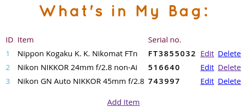

# What's in My Bag (WIMB)

A no-frills web app powered by the Python Bottle framework. As the name suggests, the app can help to keep tabs on the contents of your bag. It can be useful for photographers lugging around large amounts of photographic equipment, or anyone who has too much stuff is their bags.

## Dependencies

- Python
- Git (optional)

## Install and Run

1. Make sure Python is installed on your system.
3. Clone the project's GitHub repository using the `git clone https://github.com/dmpop/wimb.git` command. Alternatively, download the latest version of the application as a ZIP archive and extract it.
4. Switch to the *wimb* directory, and run `./wimb.py` to start the application.
5. Point the browser to http://127.0.0.1:8080/wimb to access and use the application.
