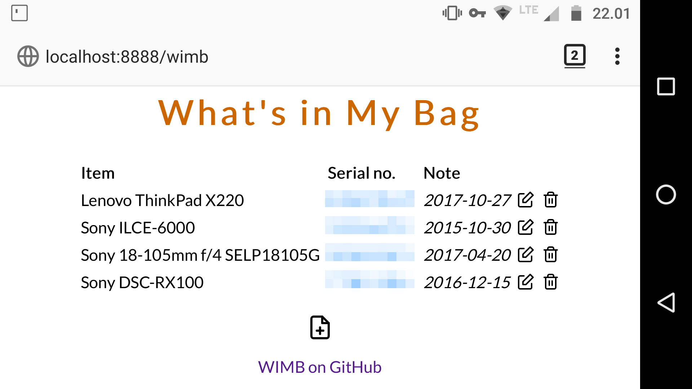

# What's in My Bag (wimb)

A no-frills web app powered by the Python Bottle framework. As the name suggests, the app can help to keep tabs on the contents of your bag. It can be useful for photographers lugging around a large amount of photographic equipment, or anyone who has too much stuff is their bags.

## Dependencies

- Python
- Python Bottle
- Git (optional)

## Install and Run

1. Install the Python Package Manager (PIP). On Debian and Ubuntu, this can be done by running the `apt-get install python-pip` command as root. On openSUSE, run the `sudo zypper in python-pip` command.
2. Install Bottle by running the `pip install bottle` command as root.
3. Clone the project's GitHub repository using the `git clone https://github.com/dmpop/wimb.git` command.
4. Switch to the *wimb* directory, and run `./wimb.py` to start the application.
5. Point the browser to http://127.0.0.1:8080/wimb to access and use the application.
